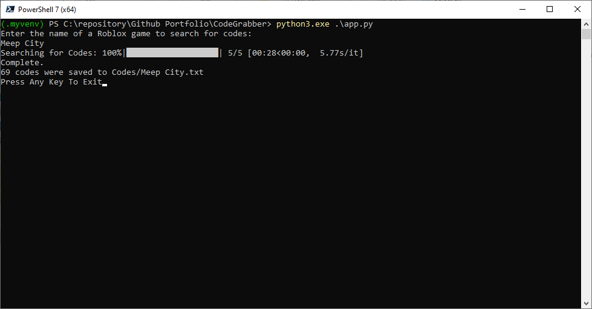

# Code Grabber

## Table of Contents

- [About](#about)
- [Getting Started](#getting_started)
- [Installation](#installing)
- [Usage](#usage)
- [Contributing](../CONTRIBUTING.md)

## About <a name = "about"></a>

Using Google's Gemini Generative AI this application will automatically find game codes for any Roblox game you prompt and it will save the codes in a text file.

## Getting Started <a name = "getting_started"></a>

These instructions will get you a copy of the project up and running on your local machine for development and testing purposes.

### Prerequisites

- python 3.9.7 - https://www.python.org/downloads/release/python-397/

    ```
    sudo apt install python==3.9.7
    ```

- pip3 - https://pip.pypa.io/en/stable/installation/

    ```
    python3.exe -m ensurepip --upgrade
    ```

### Installing

Create a new virtual enviroment.

```
mkdir env
cd env
python3 -m venv env
```

Using Linux Teminal:

```
source env/bin/activate
```

Using Windows Termninal:

```
env/bin/activate.bat //In CMD

env/bin/Activate.ps1 //In Powershell
```

Install dependencies

```
python3 -m pip install -r requirements.txt
```

## Usage <a name = "usage"></a>

To run open the app with the python interpreter.
```
python3 app.py
```
Visit: https://ai.google.dev/ and get your free API Token.

[https://ai.google.dev/]

Enter your token and it will be saved for future use.


Enter the name of any Roblox game you want to retrieve codes for.


